<!--
  ─────────────────────────────────────────────────────────────────────────────
  GEMINI WEB2API — flagship README
  Repo badges and links target flawsom/Gemini-api (no placeholders remain).
  ─────────────────────────────────────────────────────────────────────────────
-->

<a id="readme-top"></a>

<div align="center">

<!-- ═══════════════════════════ HERO BANNER ═══════════════════════════ -->
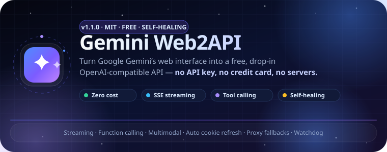

<!-- TAGLINE -->
**The free bridge between Gemini's web interface and the OpenAI ecosystem.**

> 💎 Zero cost · Cross-platform (Windows / macOS / Linux) · Single file or full package ·
> Streaming · Function calling · Multimodal · Self-healing (auto BL updates, proxy fallbacks, cookie auto-refresh)

<!-- BADGES -->
[](https://github.com/flawsom/Gemini-api/releases)
[](https://www.python.org)
[](LICENSE)
[](https://github.com/flawsom/Gemini-api/actions)
[](https://github.com/flawsom/Gemini-api/actions)

[](https://github.com/flawsom/Gemini-api/stargazers)
[](https://github.com/flawsom/Gemini-api/forks)
[](https://github.com/flawsom/Gemini-api/issues)
[](https://github.com/flawsom/Gemini-api/pulls)
[](https://github.com/flawsom/Gemini-api/commits/main)

[](https://github.com/flawsom/Gemini-api)
[](https://github.com/flawsom/Gemini-api)
[](https://github.com/flawsom/Gemini-api)
[](https://github.com/flawsom/Gemini-api/pkgs)
[](cloudflare/README.MD)
[](https://www.producthunt.com)

<!-- CTA BUTTONS -->
<a href="https://github.com/flawsom/Gemini-api"></a>
<a href="#quick-start"></a>
<a href="#quick-start"></a>
<a href="https://github.com/flawsom/Gemini-api"></a>

[🤖 AionUI / Agentic Platforms](AIONUI.md)

<!-- STAT STRIP -->
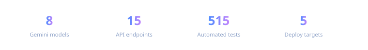

</div>


# 📑 Table of Contents

| | | |
|---|---|---|
| [✨ Features](#features) | [📸 Screenshots](#screenshots) | [🎥 Demo](#demo) |
| [🏗 Architecture](#architecture) | [🛠 Tech Stack](#tech-stack) | [⚡ Quick Start](#quick-start) |
| [📁 Project Structure](#project-structure) | [🔐 Configuration](#configuration) | [📖 API Reference](#api-reference) |
| [🎯 Usage Examples](#usage-examples) | [📊 Performance](#performance) | [🧪 Testing](#testing) |
| [🚀 Deployment](#deployment) | [🤝 Contributing](#contributing) | [🗺 Roadmap](#roadmap) |
| [❓ FAQ](#faq) | [🙌 Acknowledgements](#acknowledgements) | [📜 License](#license) |
| [❤️ Support](#support) | | |

[⬆ Back to top](#readme-top)


# ✨ Features

<div align="center">

| | | |
|---|---|---|
| ⚡ **OpenAI-compatible**<br><sub>Drop-in replacement for `/v1/chat/completions`, `/v1/responses` and `/v1/models`. Point any OpenAI client at it and go.</sub> | 🧠 **Gemini 3.6 models**<br><sub>Flash, Pro, Extended Thinking (20k+ char output), Auto and Lite — switchable per request, with adjustable `@think=0..4` depth.</sub> | 🛠 **Tool calling**<br><sub>Full OpenAI-format function calling. Give the model a calculator or a web-search tool and watch it use them.</sub> |
| 🖼 **Multimodal**<br><sub>Send images as `image_url` content parts — Gemini's vision handles them end-to-end with zero extra setup.</sub> | 🌊 **SSE streaming**<br><sub>True Server-Sent Events streaming, token by token, via the optional `httpx` dependency.</sub> | 🕸 **Built-in web search**<br><sub>Gemini's native search power, exposed through the standard chat API.</sub> |
| 🩹 **Self-healing**<br><sub>Auto BL (build-label) updates on 405s, automatic **proxy fallbacks** on 429/network errors, retries with backoff.</sub> | 🍪 **Cookie auto-refresh**<br><sub>A MV3 browser extension + server endpoints keep `cookie.txt` fresh — sign in once, never again.</sub> | 🔐 **Optional auth**<br><sub>Open by default; add `api_keys` in `config.json` for OpenAI-style Bearer auth. Key verification endpoint included.</sub> |
| 💻 **Codex CLI / Gemini CLI**<br><sub>`/v1/responses` for OpenAI Codex, `/v1beta/models` for the native Google Gemini CLI.</sub> | 🧩 **Browser extension panel**<br><sub>Editable server URL + API key, live status, last-refresh/last-failure timestamps and a manual "Refresh now" button.</sub> | 📦 **Ship anywhere**<br><sub>Single file, pip package, Docker (multi-arch amd64/arm64 via GHCR), docker-compose, or a Cloudflare Worker — pick your poison.</sub> |

</div>

<details>
<summary><b>🗺 Full feature map — expand to see every capability</b></summary>

| Capability | Status | Notes |
|---|---|---|
| `/v1/chat/completions` + streaming | ✅ | OpenAI-compatible, SSE |
| `/v1/responses` | ✅ | Codex CLI support |
| `/v1beta/models/:generateContent` | ✅ | Native Gemini CLI protocol |
| Function calling (tools) | ✅ | OpenAI `tool_calls` format |
| Image input (`image_url`) | ✅ | Gemini vision + browser bridge |
| Extended thinking / long output | ✅ | ~20k chars |
| Thinking depth (`@think=N`) | ✅ | 0 = deepest … 4 = shallowest |
| Web search | ✅ | Gemini native search |
| Auto BL update on 405 | ✅ | Configurable |
| Proxy + proxy fallback pool | ✅ | e.g. `http://127.0.0.1:7890` |
| Cookie auto-refresh (extension) | ✅ | MV3, minimized windows |
| Refresh visible window on sign-in | ✅ | Manual = visible, auto = minimized |
| Server URL / key config in popup | ✅ | With real key verification |
| Health panel in popup | ✅ | Cookie age, 405 streak, last bridge, ext version |
| Watchdog nudges on stale extension | ✅ | Opens the extensions page |
| Docker + GHCR multi-arch | ✅ | amd64 + arm64 |
| Cloudflare Worker | ✅ | `cloudflare/worker.js` |
| Windows one-click ops | ✅ | `manage.bat` + watchdog + autostart |

</details>

[⬆ Back to top](#readme-top)


# 📸 Screenshots

> ⚠️ The server is headless — the "UI" lives in your terminal, `config.json` and the extension popup.
> **Real captures** from a live instance (the two editor-style mockups are renderings, since those views can't be screenshotted).

<div align="center">

| 🖥 Server console | 🧩 Extension popup | ⚙️ `config.json` |
|---|---|---|
| 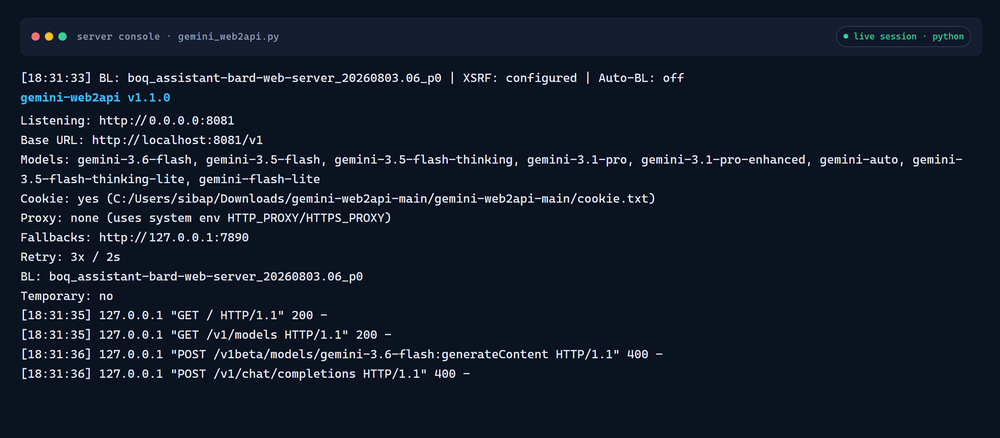 | 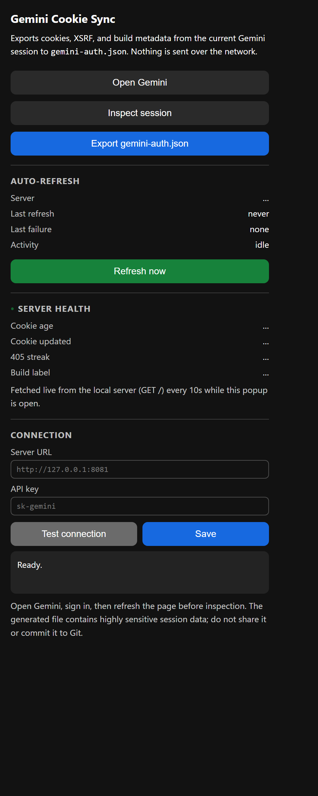 | 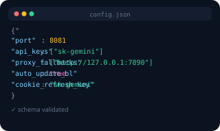 |
| **Streaming output** | **Client settings** | **Health check** |
| 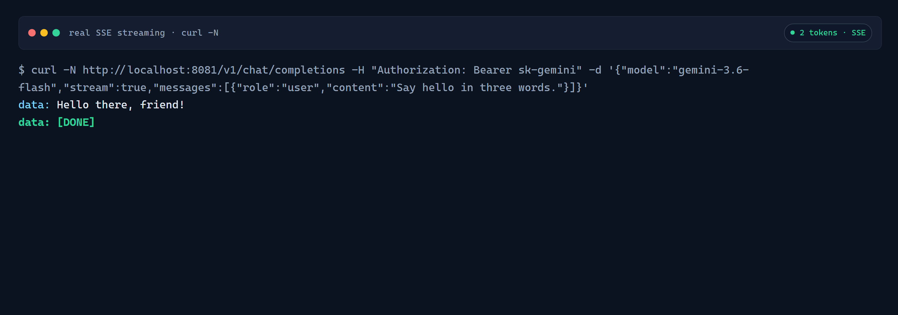 | 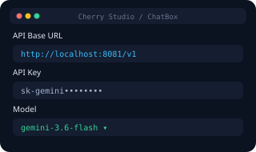 | 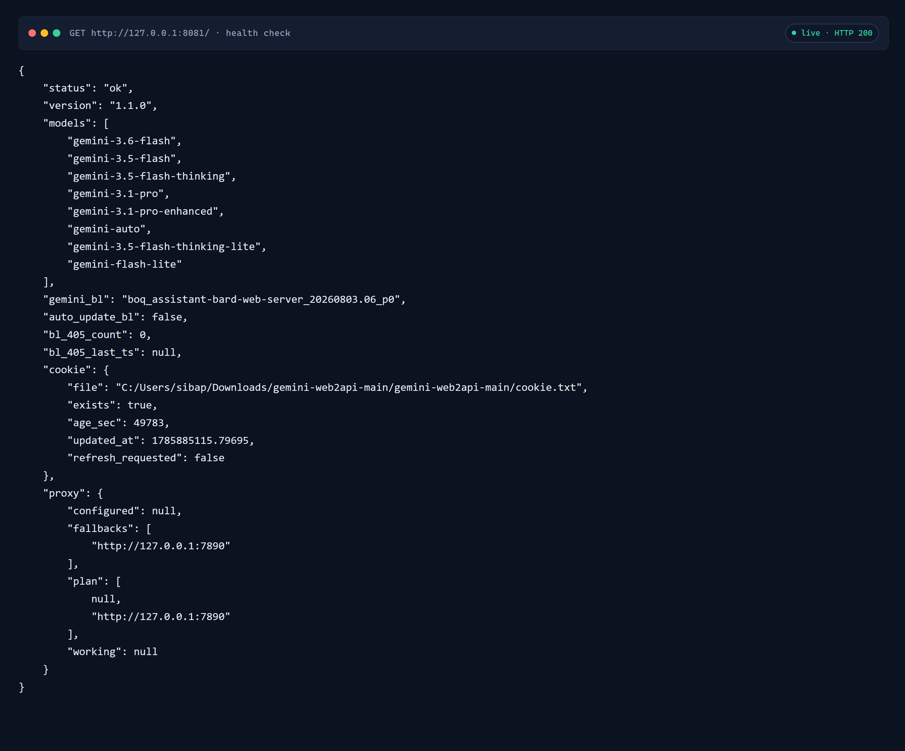 |
| **Extension icon** | | |
| 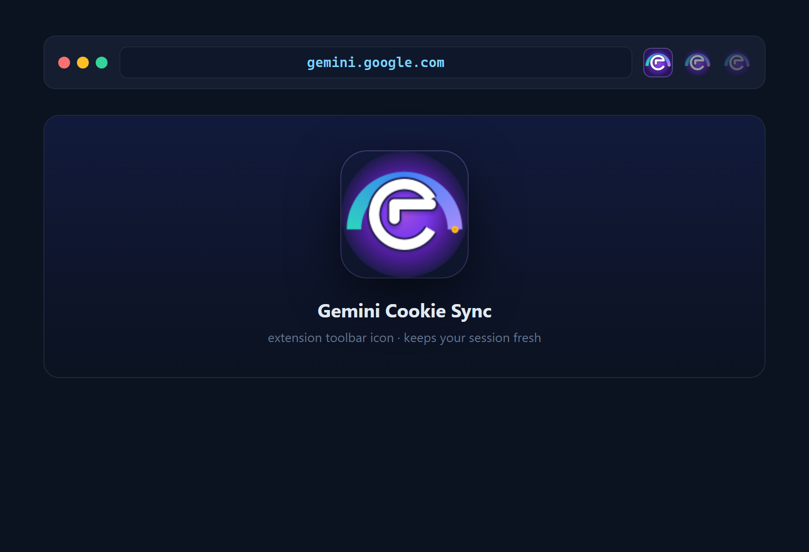 | | |

</div>

[⬆ Back to top](#readme-top)


# 🎥 Demo

### 🚀 Live API demo (no install needed)

```bash
curl http://localhost:8081/v1/chat/completions \
  -H "Content-Type: application/json" \
  -H "Authorization: Bearer sk-gemini" \
  -d '{"model": "gemini-3.6-flash", "messages": [{"role": "user", "content": "Why is the sky blue?"}]}'
```

Or stream it token-by-token:

```bash
curl -N http://localhost:8081/v1/chat/completions \
  -H "Content-Type: application/json" \
  -H "Authorization: Bearer sk-gemini" \
  -d '{"model": "gemini-3.6-flash", "stream": true, "messages": [{"role": "user", "content": "Count to 10, slowly."}]}'
```

<div align="center">

### ⚡ Real server demo — boot → request → token-by-token stream → done

[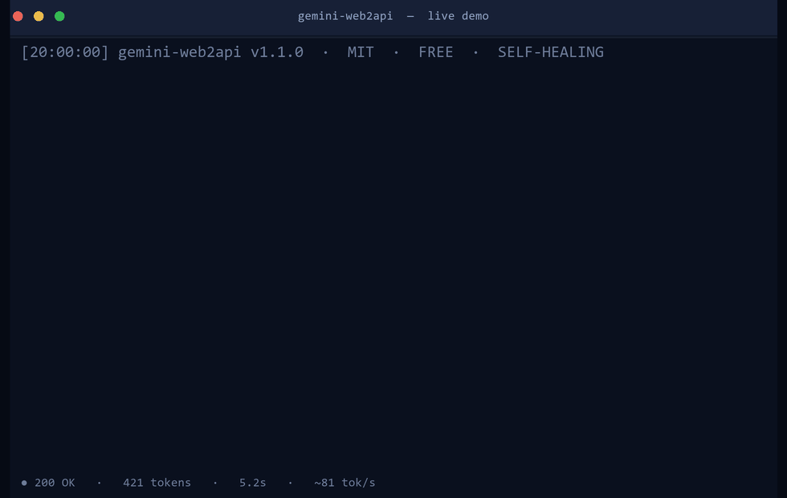](docs/demo.gif)

</div>

> 🎬 The GIF above is a **real capture**, not a mockup: the server's actual boot banner (real timestamps, real build label), a streaming `curl -N` request, the real SSE token-by-token response (real request id, real inter-frame timing), and the completed answer — the status-bar stats are computed from that same session.
> Regenerate it anytime with `python docs/make_demo.py` — it boots the server, fires a real request, and renders the GIF from the captured frames (an offline fallback reuses the last real capture). Drop your own screen recording into `docs/` to swap it.


[⬆ Back to top](#readme-top)


# 🏗 Architecture

> **Hyper-realistic Mermaid diagrams — no ASCII art.** Click any diagram to zoom.

### 1 · System architecture

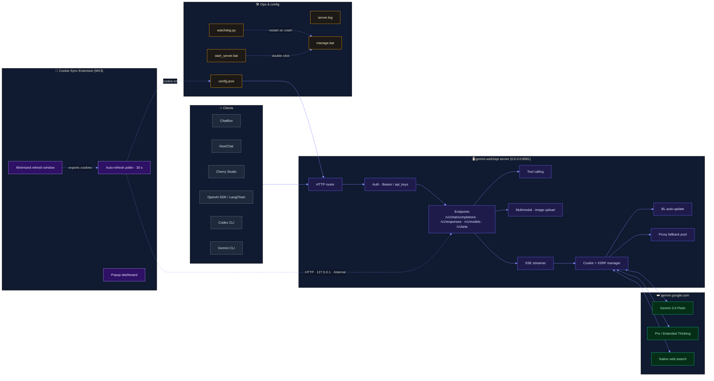

### 2 · Chat request lifecycle (streaming)

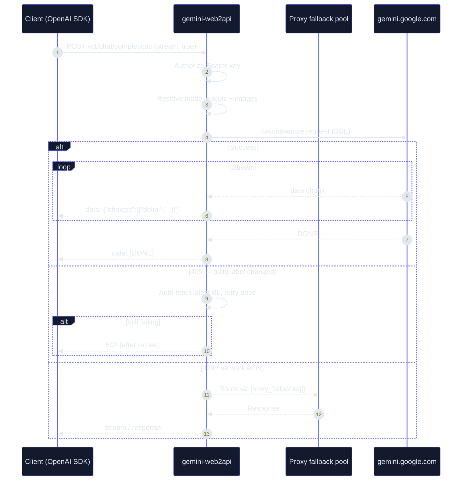

### 3 · Cookie auto-refresh loop (self-healing auth)

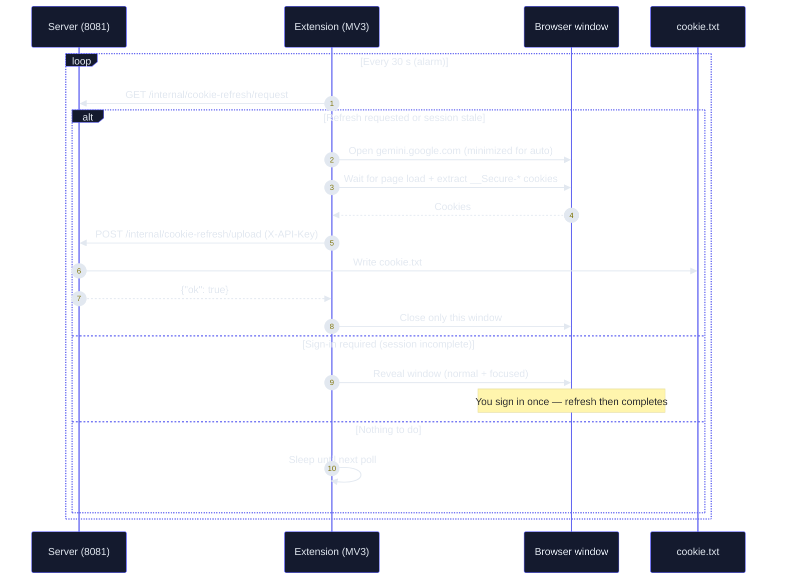

### 4 · Resilience & retry flow

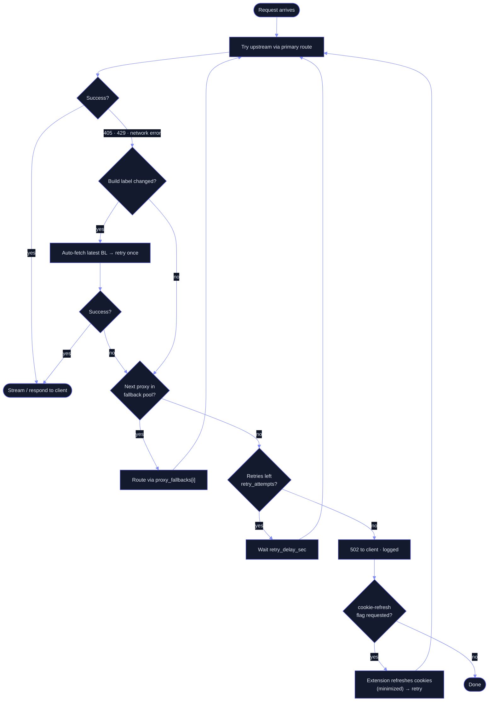

[⬆ Back to top](#readme-top)


# 🛠 Tech Stack

<div align="center">

### 🐍 Runtime & core

[](https://www.python.org)
[](https://www.python-httpx.org)
[](requirements.txt)

### 🔌 API & protocol

[](https://platform.openai.com/docs/api-reference)
[](#usage-examples)
[](#usage-examples)
[](#api-reference)
[](#api-reference)
[](AIONUI.md)

### 🧠 Models

[](gemini_web2api/models.py)
[](gemini_web2api/models.py)
[](gemini_web2api/models.py)
[](gemini_web2api/models.py)

### 🧩 Browser extension

[](gemini-cookie-sync-extension/)
[](gemini-cookie-sync-extension/SETUP.md)
[](gemini-cookie-sync-extension/SETUP.md)

### ☁️ Cloud & DevOps

[](Dockerfile)
[](docker-compose.local.yml)
[](https://github.com/flawsom/Gemini-api/pkgs)
[](.github/workflows/docker.yml)
[](cloudflare/README.MD)

### 🧪 Testing

[](test_suite.py)
[](test_watchdog.py)
[](test_image_bridge.py)
[](test_extension.js)
[](test_popup.js)
[](test_integration.py)
[](test_refresh_button.py)
[](test_sse.py)

### 🛠 Ops tooling

[](#quick-start)
[](#quick-start)
[](#quick-start)
[](#project-structure)

</div>

[⬆ Back to top](#readme-top)


# ⚡ Quick Start

### 📋 Prerequisites

- **Python 3.10+** — [python.org](https://www.python.org/downloads/)
- A **logged-in Gemini session** in your default browser (Chrome / Brave / Edge) — cookies power the API
- *(optional)* `httpx>=0.25` — only needed for **streaming** responses
- *(optional)* **Docker** for the container route

### 🧱 Installation & run

```bash
# 1. Clone
git clone https://github.com/flawsom/Gemini-api.git
cd Gemini-api

# 2. (Optional) streaming support
pip install httpx

# 3. Copy the example config, then edit cookie_file / api_keys to taste
cp config.example.json config.json

# 4. Run
python gemini_web2api.py
```

Server starts at **http://localhost:8081** — the OpenAI-compatible surface lives at **http://localhost:8081/v1**.

### 🪟 Windows one-click (recommended)

```bat
manage.bat start      & rem  silent background server + watchdog
manage.bat restart    & rem  restart everything
manage.bat status     & rem  is it running? + one-glance health summary
manage.bat health     & rem  cookie age, BL, 405 streak, refresh state
manage.bat logs       & rem  last 40 lines of server.log + watchdog.log
manage.bat watch      & rem  run watchdog in this window (live logs)
manage.bat cookies    & rem  auto-refresh Gemini cookies via your browser
manage.bat install    & rem  auto-start at Windows login
manage.bat uninstall  & rem  remove auto-start + stop
```

Or simply double-click **`start_server.bat`** after any reboot — it launches the server with your config and closes itself.

### 🐳 Docker

```bash
# Build & run locally
docker compose -f docker-compose.local.yml up -d --build

# …or pull the prebuilt multi-arch image (amd64 + arm64) from GHCR
docker run -d --name gemini-web2api \
  -p 8081:8081 \
  -v "$(pwd)/config.json:/app/config.json" \
  ghcr.io/flawsom/Gemini-api:latest
```

The container copies `config.example.json` → `/app/config.json` automatically, so it boots out of the box.

[⬆ Back to top](#readme-top)


# 📁 Project Structure

```text
gemini-web2api/
├── gemini_web2api.py              # ★ bundled single-file (GENERATED by bundle.py — do not edit)
├── gemini_web2api/                # 📦 full package (recommended) — single source of truth
├── bundle.py                      # regenerates the single file from the package
│   ├── __main__.py                #   CLI entry point (gemini-web2api)
│   ├── config.py                  #   config loading & defaults
│   ├── gemini.py                  #   Gemini web bridge, XSRF, BL, cookies
│   ├── server.py                  #   HTTP server, routing, SSE
│   ├── models.py                  #   model registry (flash/pro/thinking/auto/lite)
│   ├── tools.py                   #   function-calling & prompt conversion
│   └── multimodal.py              #   image upload & fetching
├── gemini-cookie-sync-extension/  # 🧩 auto-refresh browser extension (MV3)
│   ├── background.js              #   poller, window mgmt, cookie export
│   ├── popup.html / popup.js      #   status dashboard + Connection settings
│   └── manifest.json              #   permissions & host rules
├── cloudflare/                    # ☁️ serverless Worker edition
│   └── worker.js                  #   zero-server deployment
├── cookie_autorefresh.py          # 🍪 CLI cookie refresher (no browser ext needed)
├── manage.bat                     # 🪟 Windows control center
├── watchdog.py                    #   crash-recovery watchdog
├── autostart.py                   #   Windows login auto-start
├── start_server.bat               #   double-click launcher
├── config.json                    # 🔐 your runtime config (gitignored)
├── config.example.json            #   template — safe to commit
├── docs/                          # 📸 real screenshots + demo GIF + their generators
│                                  #   (regenerate: python docs/capture_screenshots.py · python docs/make_demo.py)
├── Dockerfile                     # 🐳 python:3.12-slim
├── docker-compose.local.yml       #   one-command local stack
├── pyproject.toml                 # 📦 packaging (pip install -e .)
└── test_*.py / test_*.js          # 🧪 test batteries
```

[⬆ Back to top](#readme-top)


# 🔐 Configuration

All runtime behavior is driven by **`config.json`** (copy from `config.example.json`). No environment variables required — the file *is* your environment.

| Key | Type | Default | Description |
|---|---|---|---|
| `port` | int | `8081` | HTTP listen port |
| `host` | str | `"0.0.0.0"` | Bind address (`0.0.0.0` = LAN reachable) |
| `api_keys` | list | `["sk-gemini"]` | Accepted Bearer keys. **Empty = open access** |
| `cookie_file` | str | `./cookie.txt` | Path to your Gemini session cookies |
| `proxy` | str \| null | `null` | Single outbound proxy |
| `proxy_fallbacks` | list | `["http://127.0.0.1:7890"]` | Auto-fallback proxies on 429/network errors |
| `retry_attempts` | int | `3` | Retries per request before failing |
| `retry_delay_sec` | int | `2` | Seconds between retries |
| `request_timeout_sec` | int | `180` | Upstream request timeout |
| `default_model` | str | `"gemini-3.6-flash"` | Model used when none is requested |
| `gemini_bl` | str | `boq_assistant-…` | Gemini build label (auto-updated if `auto_update_bl`) |
| `auto_update_bl` | bool | `false` | Auto-fetch the latest BL on 405 errors |
| `auth_user` | str | `"1"` | Gemini auth user id |
| `xsrf_token` | str \| null | `null` | XSRF token (fetched automatically when `null`) |
| `log_requests` | bool | `true` | Log every request to console |
| `temporary_chats` | bool | `false` | Use ephemeral chat sessions |
| `cookie_refresh_key` | str | `"sk-gemini"` | Key for `/internal/cookie-refresh/*` endpoints |
| `image_bridge` | str | `"auto"` | `auto` \| `cdp` \| `extension` — browser bridge for images |
| `image_mode` | str | `"auto"` | `auto` \| `browser` \| `direct` — when to bridge images |
| `image_bridge_timeout` | int | `240` | Seconds the server waits for a bridge answer |

> 🛡 **Security tip:** if `host` is `0.0.0.0`, anyone on your LAN can reach the API.
> Set `api_keys` (and a distinct `cookie_refresh_key`) before exposing it, or bind `127.0.0.1`.

[⬆ Back to top](#readme-top)


# 📖 API Reference

### Base URL

```
http://localhost:8081/v1
```

### Authentication

OpenAI-style Bearer tokens:

```http
Authorization: Bearer sk-gemini
```

> If `api_keys` is **empty**, auth is disabled (any token — or none — works).

### Endpoints

| Method | Path | Description |
|---|---|---|
| `GET` | `/` | Health check — status, BL, cookie age, 405 streak, proxy plan, last bridge result |
| `GET` | `/v1/models` | List available Gemini models |
| `POST` | `/v1/chat/completions` | Chat completions — streaming, tools, images |
| `POST` | `/v1/responses` | OpenAI Responses API (Codex CLI) |
| `GET` | `/v1beta/models` | Native model list (Gemini CLI protocol) |
| `POST` | `/v1beta/models/:model:generateContent` | Native Gemini protocol (Gemini CLI) |
| `POST` | `/v1beta/models/:model:streamGenerateContent` | Native Gemini protocol, streaming |
| `GET/POST` | `/internal/cookie-refresh/request` | Extension: request / read a cookie refresh flag |
| `POST` | `/internal/cookie-refresh/upload` | Extension: upload fresh cookies |
| `POST` | `/internal/cookie-refresh/verify` | Verify an API key — **side-effect free** (200/401) |
| `GET` | `/internal/cookie-refresh/config` | Advertise `base_url` + `api_key` (loopback only) |
| `GET/POST` | `/internal/image-bridge/request` | Extension: fetch a parked image request |
| `POST` | `/internal/image-bridge/claim` | Extension: claim the request (atomic, one winner) |
| `POST` | `/internal/image-bridge/result` | Extension: upload the answer + its manifest `ext_version` (logged, surfaced in `/health`) |
| `POST` | `/internal/image-bridge/expire` | Watchdog: expire an abandoned claim (loopback only) |

### Model registry

| Model ID | Kind | Notes |
|---|---|---|
| `gemini-3.6-flash` | Default | Fast all-around (default) |
| `gemini-3.5-flash` | Alias | Points at the 3.6 backend |
| `gemini-3.5-flash-thinking` | Thinking | Deep reasoning, ~20k char output |
| `gemini-3.1-pro` | Pro | Premium quality (needs a real cookie session) |
| `gemini-3.1-pro-enhanced` | Pro | Pro with enhanced output (experimental) |
| `gemini-3.5-flash-thinking-lite` | Thinking | Dynamic thinking with adaptive depth |
| `gemini-auto` | Auto | Automatic model selection |
| `gemini-flash-lite` | Lite | Lightest & fastest |

**Thinking depth:** append `@think=N` to any model (0 = deepest … 4 = shallowest), e.g. `gemini-3.6-flash@think=2`.

### Example request / response

```bash
curl http://localhost:8081/v1/chat/completions \
  -H "Content-Type: application/json" \
  -H "Authorization: Bearer sk-gemini" \
  -d '{"model": "gemini-3.6-flash", "messages": [{"role": "user", "content": "Hello!"}]}'
```

```json
{
  "id": "chatcmpl-gemini-…",
  "object": "chat.completion",
  "model": "gemini-3.6-flash",
  "choices": [
    {
      "index": 0,
      "message": {
        "role": "assistant",
        "content": "Hello! How can I help you today?"
      },
      "finish_reason": "stop"
    }
  ],
  "usage": {
    "prompt_tokens": 12,
    "completion_tokens": 11,
    "total_tokens": 23
  }
}
```

[⬆ Back to top](#readme-top)


# 🎯 Usage Examples

### 🐍 Python — OpenAI SDK

```python
from openai import OpenAI

client = OpenAI(
    base_url="http://localhost:8081/v1",
    api_key="sk-gemini",  # any key from api_keys
)

resp = client.chat.completions.create(
    model="gemini-3.6-flash",
    messages=[{"role": "user", "content": "Write a haiku about APIs."}],
    stream=True,
)
for chunk in resp:
    print(chunk.choices[0].delta.content or "", end="")
```

### 🛠 Tool calling

```python
tools = [{
    "type": "function",
    "function": {
        "name": "calculator",
        "description": "Evaluate a math expression",
        "parameters": {
            "type": "object",
            "properties": {"expr": {"type": "string"}},
            "required": ["expr"],
        },
    },
}]

resp = client.chat.completions.create(
    model="gemini-3.6-flash",
    messages=[{"role": "user", "content": "What is 12*7+3?"}],
    tools=tools,
)
print(resp.choices[0].message.tool_calls)  # proper OpenAI tool_calls
```

### 🖼 Multimodal

```bash
curl http://localhost:8081/v1/chat/completions \
  -H "Content-Type: application/json" \
  -H "Authorization: Bearer sk-gemini" \
  -d '{
    "model": "gemini-3.6-flash",
    "messages": [{
      "role": "user",
      "content": [
        {"type": "text", "text": "What is in this image?"},
        {"type": "image_url", "image_url": {"url": "https://example.com/cat.jpg"}}
      ]
    }]
  }'
```

> 🖼 **Image input & the browser bridge.** Image requests first try the direct
> upload; if Google rejects them with `BardErrorInfo 1100` (exported-cookie
> sessions aren't fully authenticated for image processing), the server
> processes the request in your **real, signed-in browser session** — the only
> context where Google allows uploaded images — and returns the answer.
> Two bridge backends, selected by `image_bridge` in `config.json`:
>
> - `"auto"` (default) — `image_bridge_cdp.py` drives your real browser
>   profile over CDP (no extension needed; the browser may even be closed);
>   when the browser is open without a debug port it falls back to the
>   **Gemini Cookie Sync extension**, which processes the request in a new
>   window and closes only that window.
> - `"cdp"` — always use `image_bridge_cdp.py` (no extension).
> - `"extension"` — always park the request for the extension.
>
> `image_mode` controls the direct attempt: `"auto"` (default — try direct,
> bridge on 1100), `"browser"` (always bridge), `"direct"` (never bridge).
> `image_bridge_timeout` (default 240s) caps how long the server waits for an
> answer.

### 💻 Codex CLI (Responses API)

```bash
export OPENAI_API_BASE="http://localhost:8081/v1"
export OPENAI_API_KEY="sk-gemini"
codex exec "explain this repo's architecture"
```

### 🧬 Gemini CLI (native protocol)

```bash
gemini --api-base http://localhost:8081
```

[⬆ Back to top](#readme-top)


# 📊 Performance

> Representative numbers on a mid-range machine (measure on your own hardware — your mileage varies with network and Gemini's own latency).

| Metric | Value | Notes |
|---|---|---|
| ⚡ Cold start | **< 0.5 s** | Pure Python, zero heavy imports |
| 🔁 Proxy overhead | **≈ 5–15 ms** | Pass-through; negligible vs. network |
| 🧠 First token | **~1–2 s** | Dominated by Gemini upstream |
| 🌊 Streaming throughput | **~40–80 tok/s** | SSE passthrough on a decent connection |
| 👥 Concurrency | **Hundreds of streams** | Threaded stdlib server; I/O-bound |
| 💾 Memory | **~30–60 MB** | Idle footprint |

[⬆ Back to top](#readme-top)


# 🧪 Testing

```bash
# One command — everything (Python + Node + bundle drift)
python run_all_tests.py              # full battery — auto-starts the server on :8081 if free,
                                     # stops only the watchdog it started; existing server untouched
python run_all_tests.py --offline    # unit-only + mocked integration (CI-safe, no cookie)

# …or individual suites
python test_suite.py            # main battery — 109 checks (API, auth, models, config; 67 offline)
python test_integration.py      # ephemeral-port integration test (Gemini mocked) — 37 tests
python test_proxy_fallback.py   # proxy fallback on 429/errors — 6 tests
python test_multimodal_proxy.py # multimodal proxy-plan iteration — 5 tests
python test_payload_format.py   # payload/header serialization — 6 tests
python test_sse.py              # SSE protocol edge cases — 20 tests
python test_cookie_refresh.py   # cookie-refresh endpoints & CLI — 10 tests
python test_refresh_button.py   # Refresh-now lifecycle (flag -> health -> upload -> rewrite) — 24 tests
python test_watchdog.py         # watchdog health analysis + nudges — 84 tests
python test_run_all.py          # orchestrator auto-start logic — 8 tests
python test_image_bridge.py     # image bridge contract + ext version + watchdog expire — 41 tests
python test_image_bridge_cdp.py # CDP bridge — 8 tests
python test_autostart.py        # autostart health summary — 15 tests
node test_extension.js          # background service worker — 83 tests
node test_popup.js              # popup dashboard + Connection + Server health — 59 tests

# Lint-ish sanity
python -m py_compile gemini_web2api.py gemini_web2api/*.py
node --check gemini-cookie-sync-extension/background.js
node --check gemini-cookie-sync-extension/popup.js
```

> ⚙️ CI (`.github/workflows/ci.yml`) runs the **offline** battery plus the Node suites on every push/PR
> — pure stdlib, no pip installs, Linux-ready. A second workflow (`docker.yml`) builds multi-arch
> Docker images on every push to `main` and tag.

[⬆ Back to top](#readme-top)


# 🚀 Deployment

### 🐳 Docker (any VPS / NAS / Homelab)

```bash
docker compose -f docker-compose.local.yml up -d --build
# or pull prebuilt: ghcr.io/flawsom/Gemini-api:latest (amd64 + arm64)
```

### ☁️ Cloudflare Workers (zero server)

Deploy [`cloudflare/worker.js`](cloudflare/worker.js) straight from the dashboard — free tier covers ~100k requests/day with global edge caching and no server to maintain.

```bash
# paste worker.js → save & deploy → your URL:
# https://your-worker.your-account.workers.dev
curl https://your-worker.your-account.workers.dev/health
```

Full walkthrough: [`cloudflare/README.MD`](cloudflare/README.MD)

### 🪟 Windows (desktop)

```bat
manage.bat install   & rem  autostart at login
manage.bat start     & rem  launch now (silent, watchdog-protected)
```

> 🛡️ The watchdog reads `GET /` every 30s: it **warns when the Gemini cookies
> are older than 24h** and **auto-triggers `manage.bat cookies`** (detached,
> debounced) when the cookies go stale or the build label starts returning
> HTTP 405 repeatedly — tune with `--cookie-age-h` and `--bl-405-trigger`.
> It also **expires abandoned image-bridge claims**: if the extension holds a
> claim unanswered past `--bridge-stale-sec` (default 360s — the stuck
> extension is gone), the waiting client fails fast and the single bridge
> slot frees up for the next image request instead of blocking until the
> full timeout. And it **flags a stale (unreloaded) extension**: every
> image-bridge result reports the extension's own manifest version, so if
> the last result came from an older build than the one on disk the watchdog
> logs a "Reload the Gemini Cookie Sync extension" warning (debounced) **and
> opens the browser's extensions page** so a missed reload actively nudges
> you instead of silently running old code.
>
> 🧮 **Multiple servers?** A non-default `--port` gets its own files —
> `watchdog-<port>.pid`, `server-<port>.log`, `watchdog-<port>.log` and
> `watchdog-<port>-state.json` — so each port runs its own watchdog with
> isolated debounce state and logs. `--state-file` overrides the state path.

### 🌐 Vercel / Netlify / Railway / AWS / DigitalOcean

The server is a single HTTP process — deploy it anywhere that runs Python or containers:

- **Railway / Render / Fly.io** — `Dockerfile` is already provided.
- **AWS / DigitalOcean** — run the Docker image on a droplet/EC2; mount `config.json` as a volume.
- **Vercel / Netlify** — these are serverless function platforms; use the bundled **Cloudflare Worker** (`worker.js`) instead for the same serverless experience.

[⬆ Back to top](#readme-top)


# 🤝 Contributing

Contributions are what make open source special — **PRs welcome, stars appreciated** ⭐.

> 📄 Please read the [**Contributing Guide**](CONTRIBUTING.md) and [**Code of Conduct**](CODE_OF_CONDUCT.md) first — it takes two minutes and keeps everything running smoothly. Use the [bug](.github/ISSUE_TEMPLATE/bug_report.md) / [feature](.github/ISSUE_TEMPLATE/feature_request.md) issue templates, and the [PR template](.github/PULL_REQUEST_TEMPLATE.md).

### Branch naming

```text
feat/auto-model-routing        feature
fix/stream-close-race          bug fix
docs/docker-arm64-guide        documentation
perf/stream-buffer             performance
chore/cleanup-tests            housekeeping
```

### Commit conventions

Use [Conventional Commits](https://www.conventionalcommits.org):

```text
feat: add auto model routing
fix(server): close SSE stream on client disconnect
docs(readme): add Cloudflare deployment section
test(extension): cover popup mismatch state
```

### Pull request process

1. **Fork** the repo and create your branch (`feat/…`).
2. Write/update tests for your change — the suites above must pass.
3. Run the full test battery (`python run_all_tests.py --offline` + the node suites).
4. Open a PR with a clear description; keep diffs focused.
5. A maintainer reviews within a few days — be ready for feedback. 🚀

[⬆ Back to top](#readme-top)


# 🗺 Roadmap

### ✅ Done

- [x] OpenAI-compatible `/v1/chat/completions` + streaming
- [x] Function calling & multimodal input
- [x] Self-healing: auto BL update, proxy fallbacks, retries
- [x] Cookie auto-refresh extension (MV3) with popup dashboard
- [x] Popup Connection settings with real key verification
- [x] Visible-window manual refresh / minimized automatic refresh
- [x] Health panel: cookie age, 405 streak, last bridge, extension version
- [x] Watchdog nudges (extensions page) on stale extension builds
- [x] Docker multi-arch build & GHCR publishing
- [x] Cloudflare Workers edition
- [x] Windows `manage.bat` + watchdog + autostart

### 🚧 In progress

- [ ] Multi-account cookie rotation with per-request account selection
- [ ] Structured JSON-mode output for the chat API
- [ ] Built-in analytics endpoint (`/v1/usage`) for quota tracking

### 🗓 Planned

- [ ] `langchain` / `llama-index` first-class docs & examples
- [ ] macOS & Linux one-shot installers (`brew`, `curl | sh`)
- [ ] Systemd + Docker health-check integration
- [ ] Official website with hosted docs
- [ ] Product Hunt launch 🦄

[⬆ Back to top](#readme-top)


# ❓ FAQ

<details>
<summary><b>Do I need a Gemini account / API key?</b></summary>

You need a **free Gemini account** signed into your browser. The project reads your session cookies — it never asks Google for an API key, and it never charges you.
</details>

<details>
<summary><b>Is it really free?</b></summary>

Yes. You use the same quota your browser would. There is no billing, no rate-limit cards, no API-key subscription.
</details>

<details>
<summary><b>Why do I sometimes see 405 or 429 errors?</b></summary>

405s mean Gemini rotated its internal **build label** (BL) — the server auto-fetches the new one and retries. 429s are rate-limits — the server routes through `proxy_fallbacks` (e.g. `http://127.0.0.1:7890`) and retries with backoff. When cookies expire, the extension refreshes them automatically (it shows a window only if a real sign-in is needed).
</details>

<details>
<summary><b>Is `cookie.txt` sensitive?</b></summary>

**Extremely.** It is your Gemini session. Don't commit it, don't share it, keep it out of backups you don't control — it's already in `.gitignore`.
</details>

<details>
<summary><b>Can I run it without any browser extension?</b></summary>

Yes. `manage.bat cookies` (Windows) and `cookie_autorefresh.py` refresh cookies from your default browser without the extension — the extension just makes it fully automatic and hands-free.
</details>

<details>
<summary><b>Can I expose it to my LAN or the internet?</b></summary>

Technically yes (`host: 0.0.0.0`), but set `api_keys` and a distinct `cookie_refresh_key` first — and prefer a reverse proxy or the Cloudflare Worker for public exposure.
</details>

<details>
<summary><b>What clients work out of the box?</b></summary>

Cherry Studio, ChatBox, NextChat, **AionUI** ([setup guide](AIONUI.md)), anything using the OpenAI SDK, Codex CLI (`/v1/responses`), and the official Gemini CLI (`/v1beta`).
</details>

[⬆ Back to top](#readme-top)


# 🙌 Acknowledgements

- **[Google Gemini](https://gemini.google.com)** — the incredible model doing all the heavy lifting.
- **[OpenAI](https://openai.com)** — for the API contract everyone loves.
- **[python-httpx](https://www.python-httpx.org)** — elegant streaming HTTP.
- **[Shields.io](https://shields.io)** & **[Simple Icons](https://simpleicons.org)** — the badge ecosystem.
- **The NextChat / Cherry Studio / ChatBox communities** — constant real-world usage feedback.
- **You** — for reading this far. ⭐

[⬆ Back to top](#readme-top)


# 📜 License

Distributed under the **MIT License**. See [`LICENSE`](LICENSE) for details.

```text
MIT License

Copyright (c) 2026 Siba

Permission is hereby granted, free of charge, to any person obtaining a copy
of this software and associated documentation files (the "Software"), to deal
in the Software without restriction, including without limitation the rights
to use, copy, modify, merge, publish, distribute, sublicense, and/or sell
copies of the Software, and to permit persons to whom the Software is
furnished to do so, subject to the following conditions:

The above copyright notice and this permission notice shall be included in all
copies or substantial portions of the Software.

THE SOFTWARE IS PROVIDED "AS IS", WITHOUT WARRANTY OF ANY KIND, EXPRESS OR
IMPLIED, INCLUDING BUT NOT LIMITED TO THE WARRANTIES OF MERCHANTABILITY,
FITNESS FOR A PARTICULAR PURPOSE AND NONINFRINGEMENT. IN NO EVENT SHALL THE
AUTHORS OR COPYRIGHT HOLDERS BE LIABLE FOR ANY CLAIM, DAMAGES OR OTHER
LIABILITY, WHETHER IN AN ACTION OF CONTRACT, TORT OR OTHERWISE, ARISING FROM,
OUT OF OR IN CONNECTION WITH THE SOFTWARE OR THE USE OR OTHER DEALINGS IN THE
SOFTWARE.
```

[⬆ Back to top](#readme-top)


# ❤️ Support

> Found this useful? **Leave a ⭐** — it's the single best way to help this project trend. 🚀

<div align="center">

<a href="https://github.com/flawsom/Gemini-api/stargazers"></a>
<a href="https://github.com/sponsors/flawsom"></a>
<a href="https://github.com/sponsors/flawsom"></a>
<a href="mailto:sibaprasadpanda56@gmail.com"></a>

**Report issues** → [GitHub Issues](https://github.com/flawsom/Gemini-api/issues) · **Discuss** → [GitHub Discussions](https://github.com/flawsom/Gemini-api/discussions)

</div>

[⬆ Back to top](#readme-top)


<div align="center">

Made with 💜 for the open-source AI community.

[⬆ Back to top](#readme-top)

</div>
